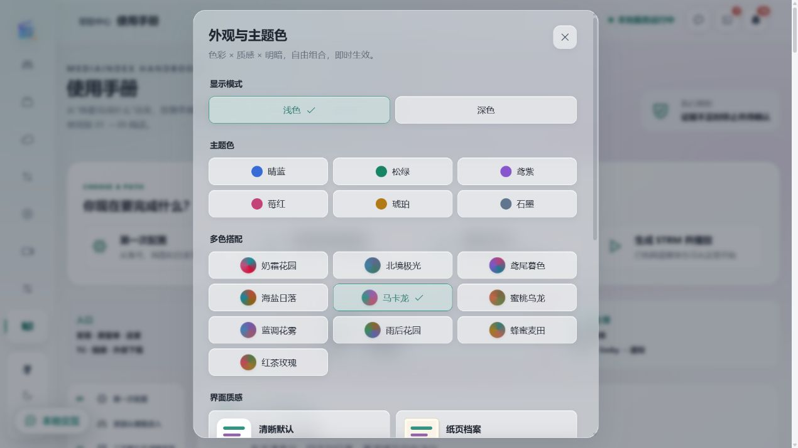
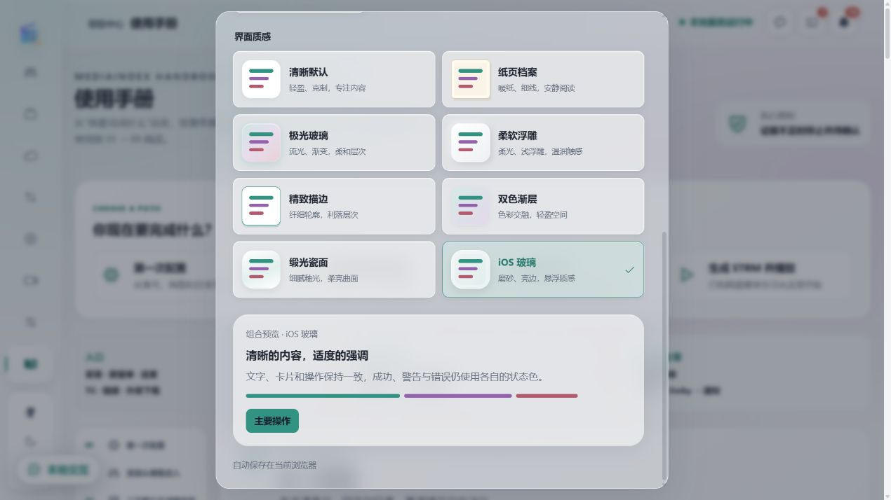
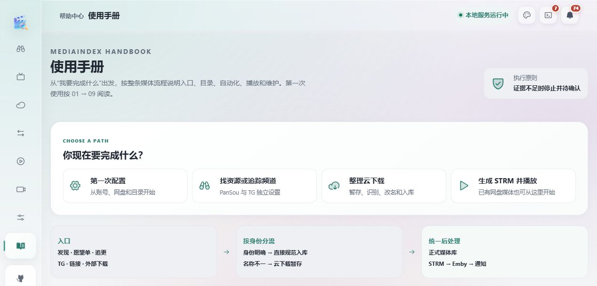
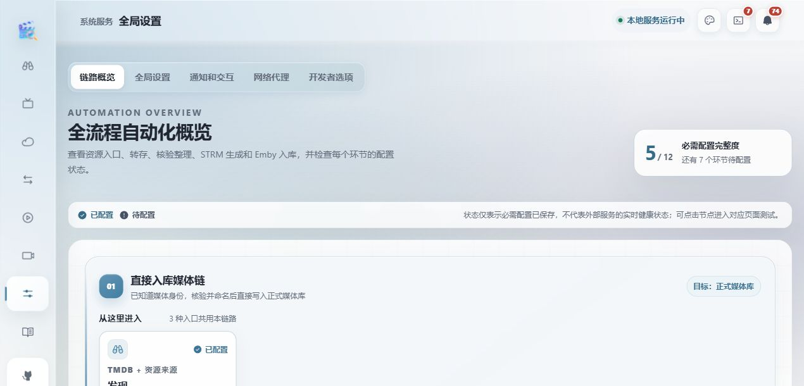
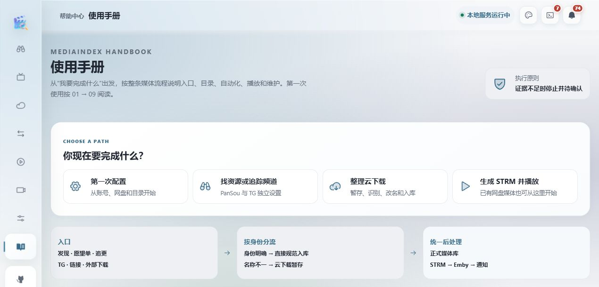
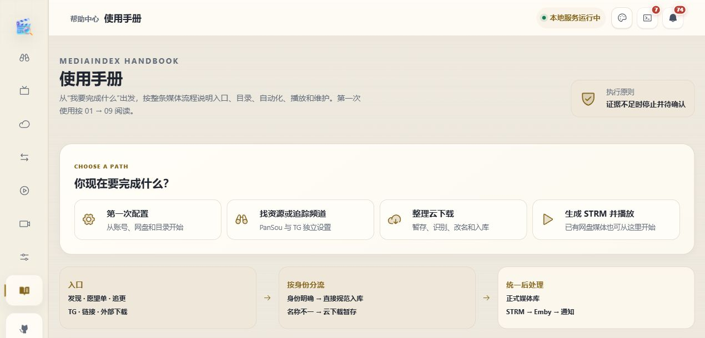

# Sunny UI Design System

一套从 MediaIndex 实际界面中整理出的配色与质感系统。用 6 个单色、10 套多色、8 种材质和浅深模式自由组合，大小卡片、控件与侧栏一起变化。

这是可运行的前端代码，也是一份给设计者和 AI 使用的参考。界面质量还需要结合实际内容与布局验收。

## 运行示例

```sh
pnpm install --frozen-lockfile
pnpm dev
```

打开终端显示的本地地址，点击右上角外观按钮。`pnpm build` 会构建可复用库和独立演示网站；`pnpm preview` 预览演示构建。

## 带到其他项目

最快的方式是复制 [`skills/sunny-ui-design/assets/appearance`](skills/sunny-ui-design/assets/appearance)，导入组件和 CSS。接入步骤见 [集成说明](skills/sunny-ui-design/references/integration.md)。本仓库也提供 ESM 库构建和 TypeScript 类型，可以通过 Git 依赖或打包文件使用，尚未发布到 npm。

- [设计规范](skills/sunny-ui-design/references/design-standard.md)：字体、布局、色彩、材质、交互和响应式规则。
- [Sunny 的常用标准](docs/sunny-preferences.md)：用于其他项目时要保留的设计偏好和适用范围。
- [AI 设计 Skill](skills/sunny-ui-design/SKILL.md)：读取后按规范完成界面或接入外观系统。
- [来源与许可](docs/sources.md)：代码出处、参考项目与第三方技能。

## 让 AI 参考

下面两段可以直接复制给能读取 GitHub 仓库或本地文件的 AI。只给仓库链接也能表达方向，但同时指定阅读顺序、接入范围和验收要求，更容易复现效果。如果 AI 无法访问 GitHub，先下载仓库，再把本地目录提供给它。

### 直接给项目增加主题系统

```text
根据 https://github.com/xudong7587/sunny-ui-design-system 项目，给当前前端增加可复用的主题系统。

先读取该仓库的 README.md、AGENTS.md、skills/sunny-ui-design/SKILL.md、
references/design-standard.md、references/integration.md 和 docs/sunny-preferences.md
（references 位于 skills/sunny-ui-design 下），再了解当前项目的技术栈和页面结构。

优先复用 assets/appearance 中的组件、配色和 CSS，将色彩 × 质感 × 明暗独立组合，
提供外观选择入口、即时预览、浏览器偏好保存，并为当前项目设置独立 storagePrefix。
将质感适配到背景、侧栏、大卡片、小卡片、输入框和按钮；iOS 玻璃最透，极光玻璃半透。
保留业务功能和状态色，遵循现有项目的布局与交互约定。
如果技术栈不是 React，保留配色、CSS 变量和设计规范，用当前框架实现等价组件。

完成后验证明暗切换、刷新保留、手机布局、文字对比度和大小卡片的质感层次，
提供实际页面截图、修改清单和运行方法；复用代码时保留 GPL-3.0-only 许可要求。
```

### 先给我风格选项

```text
参考 https://github.com/xudong7587/sunny-ui-design-system 的设计规范、示例图和可复用代码，
先了解我的项目，给我 4～6 个明显不同的前端风格选项，让我指定后再实施。

每个选项写清：配色名称和 ID、质感名称和 ID、明暗模式、适合的内容、
大卡片／小卡片／控件的表现，并给一小块实际预览或注明对应的仓库示例图。
至少包括明亮玻璃、半透流光、暖色纸页和一个清晰克制的方案，主色不要都选紫色。
可参考：马卡龙 macaron + iOS 玻璃 glass；北境极光 nord + 极光玻璃 aurora；
蜂蜜麦田 honey + 纸页档案 paper；晴蓝 blue + 精致描边 outline。

我选定方案后，读取仓库 skill 和集成说明，复用主题模块接入现有项目，
保留业务行为，完成桌面、手机及明暗模式验收。
```

也可把 `skills/sunny-ui-design` 整个目录复制到你的技能目录。代码与详细参考都在该目录内，复制后仍能使用。

## 看看实际效果

以下为 MediaIndex 本地前端的实际截图，使用手册和全局设置页面展示外观，不包含媒体海报。截取页面上半部分，避开本地调试入口。业务内容用于展示层次，复用模块不依赖 MediaIndex 后端。

### 圆形色盘与 8 种质感

单色和多色分开选择，多色按钟表方向渐变成圆形色盘。质感可与任何配色、明暗模式组合。





### 马卡龙 × iOS 玻璃

薄而透明的表面、清晰亮边与多层背景，适合轻盈的工具界面。



### 北境极光 × 极光玻璃

蓝色主调、半透流光与柔和层次。全局设置中的容器和内层卡片一起响应外观选择。



<details>
<summary>同一手册页面的极光玻璃效果</summary>



</details>

### 蜂蜜麦田 × 纸页档案

暖金主色、纸感底色与细线，适合说明、设置和长内容阅读。



## 许可

GPL-3.0-only。代码源自 [MediaIndex](https://github.com/xudong7587/media-index)，保留其许可。第三方参考只用于设计思路，不附带其源码或完整 Skill；使用时遵循对应项目许可。
