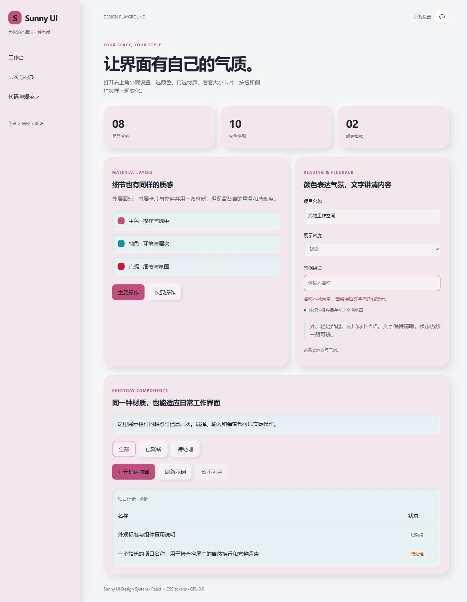
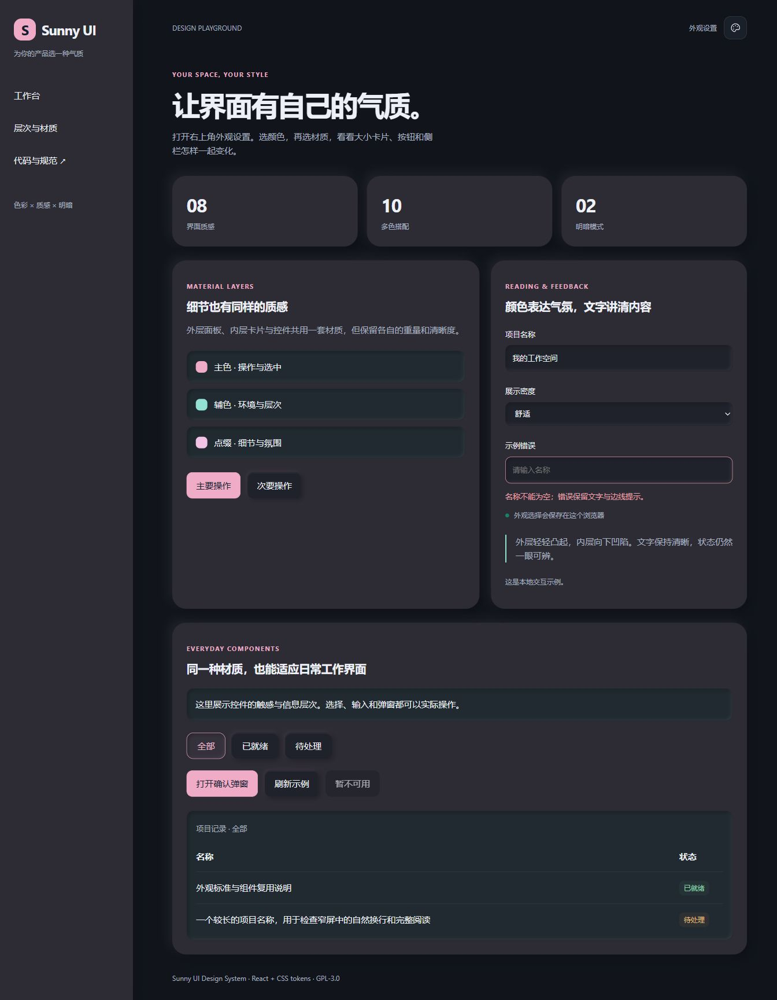
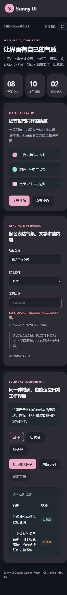
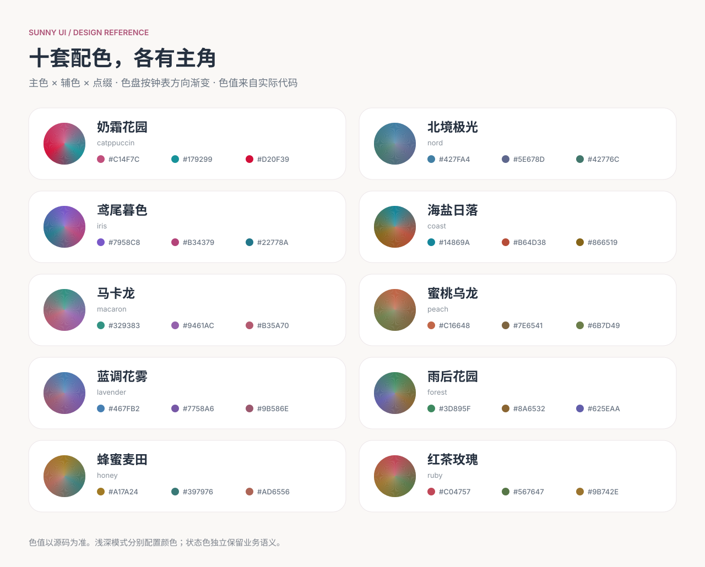
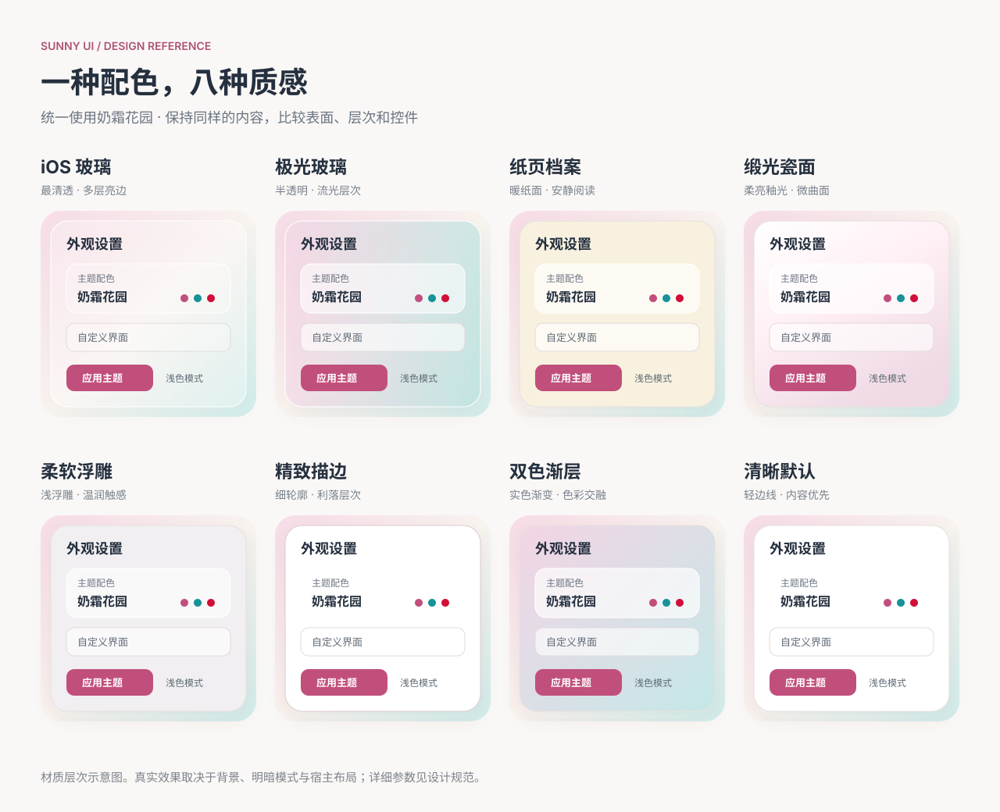
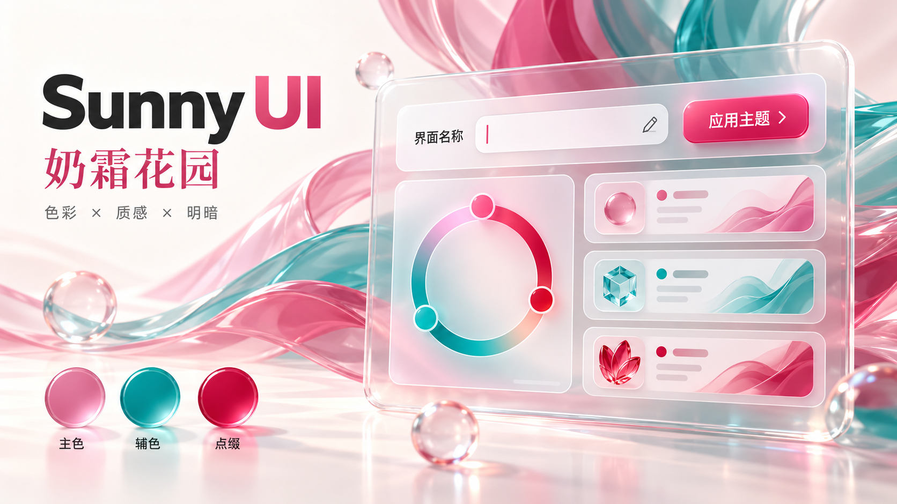

# Sunny UI Design System

一套从 MediaIndex 实际界面中整理出的配色与质感系统。6 个单色、10 套多色、8 种材质与浅深模式可以自由组合，大小卡片、控件与侧栏使用同一套外观规则。

[最新发布：v1.0.2](https://github.com/xudong7587/sunny-ui-design-system/releases/latest) · [设计规范](skills/sunny-ui-design/references/design-standard.md) · [接入说明](skills/sunny-ui-design/references/integration.md) · [AI 设计 Skill](skills/sunny-ui-design/SKILL.md)

## 1.0.2 实际效果

这一版完善了「柔软浮雕」：外层面板轻轻凸起，内层卡片和输入框向内凹陷；按钮有按压反馈，选中、禁用、错误和键盘焦点各有清楚的表现。演示页可实际操作筛选、表单和确认弹窗。

下面是 1.0.2 演示页的浏览器截图，使用「奶霜花园 × 柔软浮雕」。桌面预览按明暗偏好显示相应截图。

<picture>
  <source media="(prefers-color-scheme: dark)" srcset="docs/images/soft-desktop-dark.jpg">
  
</picture>

<details>
<summary>查看深色桌面与手机完整截图</summary>

### 深色桌面

深色模式收敛高光，保留面板与内层卡片的明暗差异。



### 手机布局

窄屏改用单列，长名称自然换行，表单与操作区依次排列。



</details>

复现这些效果：运行本仓库演示，打开右上角「外观设置」，选择奶霜花园配色和柔软浮雕材质，再切换浅深模式。具体检查项与验证边界见 [1.0.2 验证记录](docs/1.0.2-validation.md)；接入其他产品后，仍需结合实际内容和布局验收。

## 配色与材质参考

### 十套多色配色

下图从源码色值生成，展示主色、辅色、点缀与顺时针渐变色盘。更新配色后运行 `python docs/render_showcase.py` 可重新生成。



### 八种质感

使用同样的奶霜花园配色和内容比较材质。iOS 玻璃更清透，极光玻璃半透，纸页与瓷面各有不同。下图为材质层次示意，实际组件效果可在演示中切换查看。



<details>
<summary>查看早期立体玻璃设计示意</summary>

这张 AI 生成的主视觉展示奶霜花园配色与立体玻璃的设计方向。图中的三维物体属于示意内容；可复用组件、文字和色值以源码及上方实际截图为准。



运行演示并选择「奶霜花园 + iOS 玻璃」，可查看组件的方向性高光、亮边、内侧反光和悬浮阴影。实际背景和布局由接入项目决定。

</details>

## 运行示例

```sh
pnpm install --frozen-lockfile
pnpm dev
```

打开终端显示的本地地址，点击右上角外观按钮。`pnpm build` 会构建可复用库和独立演示网站；`pnpm preview` 预览演示构建。

## 带到其他项目

v1.0.2 提供两种下载：

- [React 组件包（.tgz）](https://github.com/xudong7587/sunny-ui-design-system/releases/download/v1.0.2/xudong7587-sunny-ui-design-system-1.0.2.tgz)：包含 ESM 组件、CSS、TypeScript 类型和 skill。
- [AI 设计 Skill（.zip）](https://github.com/xudong7587/sunny-ui-design-system/releases/download/v1.0.2/sunny-ui-design-skill-1.0.2.zip)：包含设计规范、接入说明与可复用外观源码。

最快的方式是复制 [`skills/sunny-ui-design/assets/appearance`](skills/sunny-ui-design/assets/appearance)，导入组件和 CSS。接入步骤见 [集成说明](skills/sunny-ui-design/references/integration.md)。本仓库也提供 ESM 库构建和 TypeScript 类型，可以通过 Git 依赖或打包文件使用，尚未发布到 npm。

- [设计规范](skills/sunny-ui-design/references/design-standard.md)：字体、布局、色彩、材质、交互和响应式规则。
- [Sunny 的常用标准](docs/sunny-preferences.md)：用于其他项目时要保留的设计偏好和适用范围。
- [AI 设计 Skill](skills/sunny-ui-design/SKILL.md)：读取后按规范完成界面或接入外观系统。
- [来源与许可](docs/sources.md)：代码出处、参考项目与第三方技能。

## 让 AI 参考

下面两段可以直接复制给能读取 GitHub 仓库或本地文件的 AI。只给仓库链接也能表达方向，但同时指定阅读顺序、接入范围和验收要求，更容易复现效果。如果 AI 无法访问 GitHub，先下载仓库，再把本地目录提供给它。

### 直接给项目增加主题系统

```text
根据 https://github.com/xudong7587/sunny-ui-design-system 项目，给当前前端增加可复用的主题系统。

先读取该仓库的 README.md、AGENTS.md、skills/sunny-ui-design/SKILL.md、
references/design-standard.md、references/integration.md 和 docs/sunny-preferences.md
（references 位于 skills/sunny-ui-design 下），再了解当前项目的技术栈和页面结构。

优先复用 assets/appearance 中的组件、配色和 CSS，将色彩 × 质感 × 明暗独立组合，
提供外观选择入口、即时预览、浏览器偏好保存，并为当前项目设置独立 storagePrefix。
将质感适配到背景、侧栏、大卡片、小卡片、输入框和按钮；iOS 玻璃最透，极光玻璃半透。
保留业务功能和状态色，遵循现有项目的布局与交互约定。
如果技术栈不是 React，保留配色、CSS 变量和设计规范，用当前框架实现等价组件。

完成后验证明暗切换、刷新保留、手机布局、文字对比度和大小卡片的质感层次，
提供实际页面截图、修改清单和运行方法；复用代码时保留 GPL-3.0-only 许可要求。
```

### 先给我风格选项

```text
参考 https://github.com/xudong7587/sunny-ui-design-system 的设计规范、示例图和可复用代码，
先了解我的项目，给我 4～6 个明显不同的前端风格选项，让我指定后再实施。

每个选项写清：配色名称和 ID、质感名称和 ID、明暗模式、适合的内容、
大卡片／小卡片／控件的表现，并给一小块实际预览或注明对应的仓库示例图。
至少包括明亮玻璃、半透流光、暖色纸页和一个清晰克制的方案，主色不要都选紫色。
可参考：马卡龙 macaron + iOS 玻璃 glass；北境极光 nord + 极光玻璃 aurora；
蜂蜜麦田 honey + 纸页档案 paper；晴蓝 blue + 精致描边 outline。

我选定方案后，读取仓库 skill 和集成说明，复用主题模块接入现有项目，
保留业务行为，完成桌面、手机及明暗模式验收。
```

也可把 `skills/sunny-ui-design` 整个目录复制到你的技能目录。代码与详细参考都在该目录内，复制后仍能使用。

## 许可

GPL-3.0-only。代码源自 [MediaIndex](https://github.com/xudong7587/media-index)，保留其许可。第三方参考只用于设计思路，不附带其源码或完整 Skill；使用时遵循对应项目许可。
