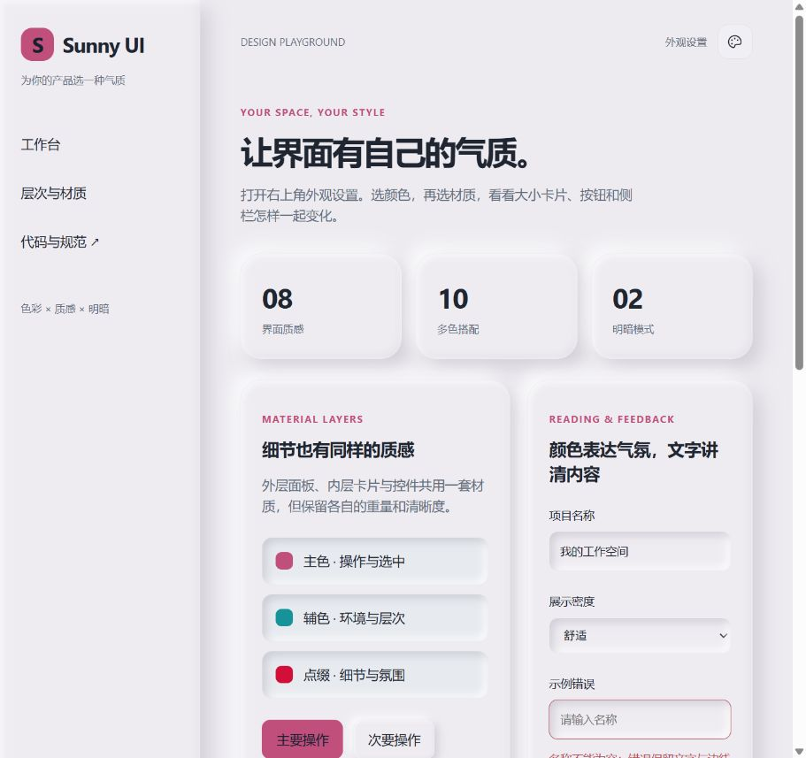

# 1.0.3 验证记录

本版将 MediaIndex Next 视觉迁入过程中确认的材质经验更新到通用源码和 Skill，保留八种材质 ID、公共变量、偏好存储和组件 API。

## 改动

连续浮雕使用接近画布的基底、双向宽柔影和轻内侧倒角；外层凸起，内层与输入凹陷，暗色单独收敛柔光。纸页、极光、玻璃、双色、描边和缎光各有自己的环境与表面权重。补充宿主层叠冲突、条件渲染最后面板跨列、低矮侧栏和窄屏布局的实战方法。

通用代码只在 `skills/sunny-ui-design/assets/appearance/` 维护；MediaIndex 使用同一份 CSS，仅另加产品选择器与布局映射。没有迁入业务数据、API 或示例状态。

## 已完成

- `pnpm typecheck`：通过。
- `pnpm build`：类型声明、组件库、演示站通过。
- 本地演示：八种材质逐项切换，926px 默认视口无文档横向溢出。
- 奶霜花园 × soft：浅深模式检查；深色刷新后保持，Esc 关闭选择器。
- 宿主 MediaIndex：320 / 390 / 700 / 1024 / 1440px 的九个主页面检查在迁入验收记录中；本版通用源码同步后额外复核侧栏与连接表单。

## 验证边界

系统强制颜色、减少透明度、浏览器缩放和完整键盘遍历未在实际系统环境验收。对应规则保留。宿主的视觉结果仍取决于自身背景、层叠顺序和真实内容，不能仅凭库构建声称自动满足所有辅助环境。
